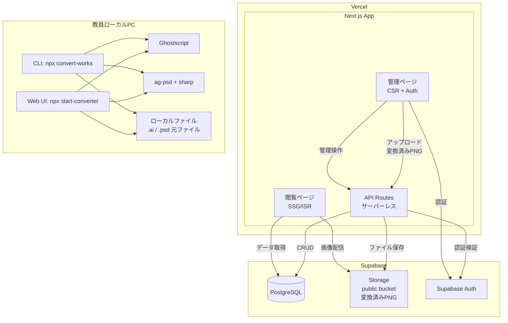
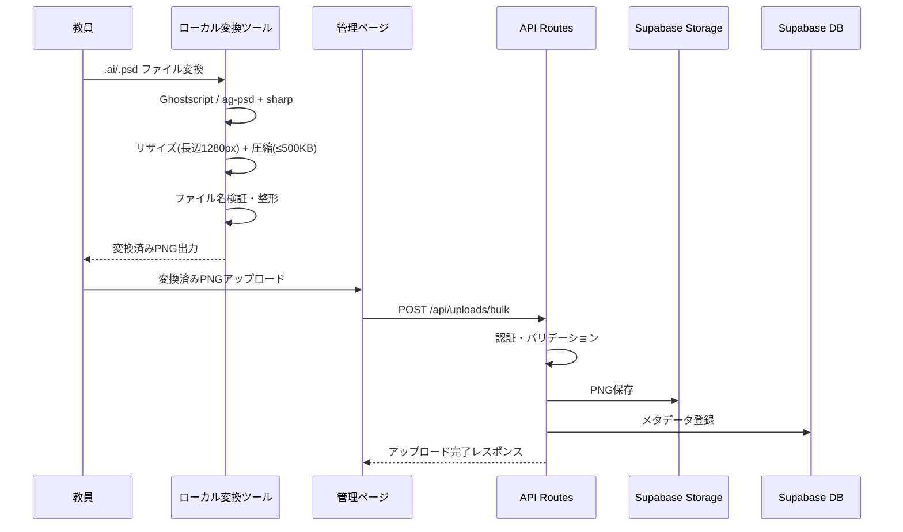
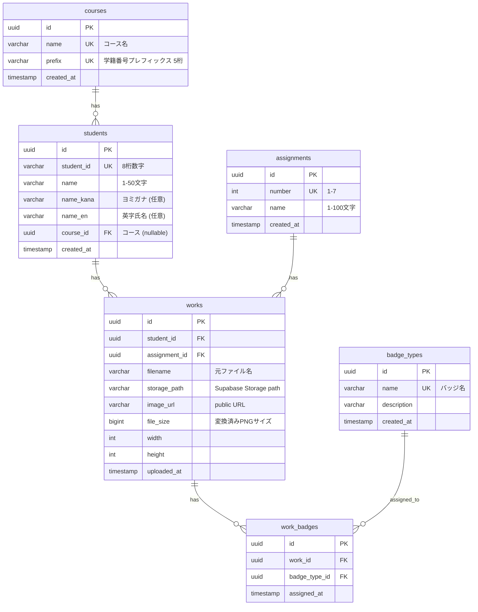

# Design Document

## Overview

Adobe Portfolio Viewerは、Adobe Illustrator（.ai）およびPhotoshop（.psd）形式の学生課題作品をPNGに変換し、Webブラウザ上で閲覧できるようにするシステムである。

### システム構成

- **フロントエンド（Next.js on Vercel）**: 閲覧ページ（SSG/ISR、認証不要）と管理ページ（CSR、Supabase Auth認証）を単一Next.jsアプリで提供する。
- **バックエンド（Next.js API Routes）**: Vercel上で動作するサーバーレスAPI。認証・ファイル処理・データ管理を担当する。
- **データベース（Supabase PostgreSQL）**: 学生・課題・ファイルメタデータ・バッジ情報を保持する。
- **ファイルストレージ（Supabase Storage）**: 変換済みPNGのみを保存。public bucketでCDN経由配信。約350MB。
- **認証（Supabase Auth）**: 教員向けメール/パスワード認証を提供する。
- **ローカル変換ツール（packages/converter）**: 教員のローカルPCで動作するNode.jsアプリケーション。CLI（`npx convert-works`）とWeb UI（`npx start-converter`）の2モードを提供する。元ファイル（.ai/.psd）はアップロードしない。

### 技術スタック

| レイヤー             | 技術                                        |
| -------------------- | ------------------------------------------- |
| フロントエンド + API | Next.js 14 (App Router), TypeScript, Vercel |
| 閲覧ページ           | SSG/ISR, React Server Components            |
| 管理ページ           | CSR, @supabase/auth-helpers-nextjs          |
| データベース         | Supabase (PostgreSQL)                       |
| ファイルストレージ   | Supabase Storage (public bucket)            |
| 認証                 | Supabase Auth                               |
| ファイル変換 (.ai)   | Ghostscript（CLI呼び出し、教員PC）          |
| ファイル変換 (.psd)  | ag-psd + sharp（教員PC）                    |
| 画像リサイズ・圧縮   | sharp（教員PC）                             |
| PBTライブラリ        | fast-check                                  |

### 設計判断の根拠

1. **Next.js App Router**: フロントエンドとAPI Routesを単一プロジェクトで管理することで、デプロイと開発のオーバーヘッドを最小化する。閲覧ページはSSG/ISRで高速表示、管理ページはCSR + Supabase Authでインタラクティブに動作する。
2. **Supabase統合利用**: DB（PostgreSQL）+ Storage + Auth を1サービスで統合し、無料枠内で運用する。個別にDB・ストレージ・認証を構築するよりも初期コストとメンテナンスコストが低い。
3. **ローカル変換ツール**: .ai変換にGhostscript（システム依存）が必要なため、サーバーレス環境（Vercel）での変換は不可能。教員のローカルPCで変換を完結させ、変換済みPNGのみをアップロードする設計とする。
4. **モノレポ構成**: Next.jsアプリとconverterツールを同一リポジトリで管理し、共通の型定義やバリデーションロジックを共有する。
5. **Supabase Storage public bucket**: CDN経由で学生に高速配信。署名付きURLの管理が不要で実装がシンプル。
6. **Ghostscript for .ai**: AIファイルは内部的にPDF/PostScript形式であり、GhostscriptがCLIベースで最も信頼性の高い変換手段。
7. **ag-psd + sharp for .psd**: ag-psdはPSDのレイヤー構造をJavaScriptで解析でき、全レイヤー統合後のピクセルデータをBufferとして取得可能。sharpで高速にPNG変換・リサイズ・圧縮を行う。

## Architecture

### システムアーキテクチャ図



### アップロードフロー



### ディレクトリ構成

```
catalog-vector-pixel/
├── app/                          # Next.js App Router
│   ├── (viewer)/                 # 閲覧ページグループ（認証不要）
│   │   ├── page.tsx              # 作品一覧（トップ）
│   │   └── works/[id]/page.tsx   # 作品詳細
│   ├── (admin)/                  # 管理ページグループ（認証必須）
│   │   ├── layout.tsx            # 認証チェックLayout
│   │   ├── dashboard/page.tsx
│   │   ├── upload/page.tsx
│   │   ├── bulk-upload/page.tsx
│   │   ├── badges/page.tsx
│   │   ├── students/page.tsx
│   │   └── assignments/page.tsx
│   ├── auth/
│   │   └── login/page.tsx
│   ├── api/                      # API Routes
│   │   ├── uploads/
│   │   │   ├── single/route.ts
│   │   │   └── bulk/route.ts
│   │   ├── works/
│   │   │   └── route.ts
│   │   ├── badges/
│   │   │   └── route.ts
│   │   ├── students/
│   │   │   ├── route.ts
│   │   │   └── import/route.ts
│   │   └── assignments/
│   │       └── route.ts
│   └── layout.tsx
├── components/                   # 共通UIコンポーネント
│   ├── viewer/
│   └── admin/
├── lib/                          # 共通ライブラリ
│   ├── supabase/
│   │   ├── client.ts             # ブラウザ用クライアント
│   │   ├── server.ts             # サーバー用クライアント
│   │   └── admin.ts              # Service Role Key用
│   ├── validators/
│   │   ├── upload.ts
│   │   ├── master-data.ts
│   │   └── filename.ts
│   └── types/
│       └── index.ts
├── packages/
│   └── converter/                # ローカル変換ツール
│       ├── src/
│       │   ├── cli.ts            # CLIエントリポイント
│       │   ├── server.ts         # Web UIサーバー
│       │   ├── converter/
│       │   │   ├── ai-converter.ts
│       │   │   ├── psd-converter.ts
│       │   │   └── image-processor.ts
│       │   ├── validators/
│       │   │   └── filename.ts
│       │   └── ui/               # Web UI（React/HTML）
│       └── package.json
├── supabase/
│   ├── migrations/               # DBマイグレーション
│   └── seed.sql
├── next.config.ts
├── package.json                  # ワークスペースルート
└── tsconfig.json
```

## Components and Interfaces

### API Routes 定義

#### アップロード API

| Method | Path                  | Description                              | Auth                |
| ------ | --------------------- | ---------------------------------------- | ------------------- |
| POST   | `/api/uploads/single` | 単体PNGアップロード                      | Yes (Supabase Auth) |
| POST   | `/api/uploads/bulk`   | バルクPNGアップロード（最大150ファイル） | Yes                 |

#### 作品 API

| Method | Path         | Description                                      | Auth |
| ------ | ------------ | ------------------------------------------------ | ---- |
| GET    | `/api/works` | 作品一覧取得（フィルター・ページネーション対応） | No   |

#### バッジ API

| Method | Path                | Description    | Auth |
| ------ | ------------------- | -------------- | ---- |
| POST   | `/api/badges`       | バッジ付与     | Yes  |
| DELETE | `/api/badges/:id`   | バッジ削除     | Yes  |
| GET    | `/api/badges/types` | バッジ種別一覧 | No   |

#### マスターデータ API

| Method | Path                   | Description       | Auth |
| ------ | ---------------------- | ----------------- | ---- |
| GET    | `/api/students`        | 学生一覧          | Yes  |
| POST   | `/api/students`        | 学生登録          | Yes  |
| POST   | `/api/students/import` | CSV一括インポート | Yes  |
| GET    | `/api/assignments`     | 課題一覧          | No   |
| POST   | `/api/assignments`     | 課題登録          | Yes  |
| GET    | `/api/courses`         | コース一覧        | Yes  |
| POST   | `/api/courses`         | コース登録        | Yes  |

### API Routes 型定義

```typescript
// app/api/uploads/single/route.ts
interface SingleUploadRequest {
  studentId: string; // 学生UUID
  assignmentId: string; // 課題UUID
  file: File; // PNG (≤2MB)
}

interface SingleUploadResponse {
  success: true;
  work: {
    id: string;
    studentName: string;
    assignmentName: string;
    filename: string;
    imageUrl: string;
  };
}

// app/api/uploads/bulk/route.ts
interface BulkUploadRequest {
  assignmentId: string; // 課題UUID
  files: File[]; // PNG[]（最大150ファイル、命名規則準拠）
}

interface BulkUploadResponse {
  totalFiles: number;
  successCount: number;
  failureCount: number;
  successes: { filename: string; studentName: string }[];
  failures: { filename: string; reason: BulkUploadFailureReason }[];
}

type BulkUploadFailureReason =
  | "FILENAME_PATTERN_MISMATCH"
  | "STUDENT_NOT_FOUND"
  | "FILE_TOO_LARGE"
  | "INVALID_FORMAT"
  | "STORAGE_ERROR";

// app/api/works/route.ts
interface WorksQueryParams {
  studentIds?: string[]; // 学生UUIDフィルター
  assignmentIds?: string[]; // 課題UUIDフィルター
  badgeIds?: string[]; // バッジUUIDフィルター
  hasBadge?: boolean; // バッジ有無フィルター
  page?: number; // default: 1
  pageSize?: number; // default: 20
}

interface WorksResponse {
  works: WorkItem[];
  total: number;
  page: number;
  pageSize: number;
  totalPages: number;
}

interface WorkItem {
  id: string;
  studentId: string;
  studentName: string;
  assignmentId: string;
  assignmentName: string;
  assignmentNumber: number;
  imageUrl: string; // Supabase Storage public URL
  uploadedAt: string;
  badges: { id: string; name: string }[];
}
```

### ローカル変換ツール インターフェース

```typescript
// packages/converter/src/converter/types.ts
interface ConversionOptions {
  inputDir: string; // 入力フォルダ
  outputDir: string; // 出力フォルダ
  assignment: number; // 課題番号（ファイル名検証用）
  maxLongSide: number; // default: 1280
  maxSizeBytes: number; // default: 512_000 (500KB)
}

interface ConversionResult {
  success: boolean;
  inputPath: string;
  outputPath?: string;
  outputSize?: number;
  width?: number;
  height?: number;
  error?: string;
  durationMs: number;
}

interface ConversionSummary {
  totalFiles: number;
  successCount: number;
  failureCount: number;
  skippedCount: number;
  outputDir: string;
  results: ConversionResult[];
  skipped: { filename: string; reason: string }[];
}

// packages/converter/src/converter/ai-converter.ts
interface AiConverter {
  /**
   * GhostscriptでAIファイルをPNGに変換する
   * 前提: gsコマンドがPATH上に存在すること
   * タイムアウト: 60秒
   */
  convert(inputPath: string): Promise<Buffer>;
}

// packages/converter/src/converter/psd-converter.ts
interface PsdConverter {
  /**
   * ag-psdでPSDを解析し、全レイヤー統合後のピクセルデータを取得する
   */
  convert(inputPath: string): Promise<Buffer>;
}

// packages/converter/src/converter/image-processor.ts
interface ImageProcessor {
  /**
   * sharpで画像をリサイズ（長辺maxLongSide px）し、maxSizeBytes以下に圧縮する
   * アスペクト比を維持する
   */
  resizeAndCompress(
    input: Buffer,
    maxLongSide: number,
    maxSizeBytes: number,
  ): Promise<{ buffer: Buffer; width: number; height: number }>;
}

// packages/converter/src/validators/filename.ts
interface FilenameValidator {
  /**
   * ファイル名が命名規則（{学籍番号}_{氏名}.png）に適合するか検証する
   * @returns パース結果またはnull（不適合の場合）
   */
  parse(filename: string): { studentId: string; name: string } | null;

  /**
   * 修正候補を提示する
   */
  suggestCorrection(filename: string): string | null;
}
```

### 認証（Supabase Auth）

```typescript
// lib/supabase/server.ts
import { createServerClient } from "@supabase/ssr";

// API Routes内でのユーザー認証チェック
async function getAuthenticatedUser(request: Request) {
  const supabase = createServerClient(/* ... */);
  const {
    data: { user },
    error,
  } = await supabase.auth.getUser();
  if (error || !user) {
    return null; // 認証失敗
  }
  return user;
}
```

### バリデーター（共通）

```typescript
// lib/validators/upload.ts
interface UploadValidator {
  /**
   * PNGファイルバリデーション
   * - 拡張子: .png のみ
   * - サイズ: 2MB以下
   */
  validatePngFile(file: File): ValidationResult;
}

// lib/validators/filename.ts
interface FilenameParser {
  /**
   * バルクアップロード用ファイル名パース
   * パターン: {学籍番号}_{氏名}.png
   * 例: 12345001_黒須哲郎.png
   */
  parse(filename: string): { studentId: string; name: string } | null;
}

// lib/validators/master-data.ts
interface MasterDataValidator {
  /** 学籍番号: 8桁数字 */
  validateStudentId(id: string): boolean;

  /** 氏名: 1〜50文字 */
  validateStudentName(name: string): boolean;

  /** 課題番号: 1〜7の整数 */
  validateAssignmentNumber(num: number): boolean;

  /** 課題名: 1〜100文字 */
  validateAssignmentName(name: string): boolean;
}

// lib/validators/csv-import.ts
interface CsvImportValidator {
  /**
   * CSVファイルのパースと検証
   * - BOM付きUTF-8対応（先頭の\uFEFFを自動除去）
   * - 必須カラム: 「学籍番号」「学生氏名」
   * - 任意カラム: 「ヨミガナ」「英字氏名」
   * - 余分なカラム（空カラム含む）は自動無視
   * - 最大200行
   */
  parseAndValidate(csvContent: string): CsvImportResult;
}

interface CsvImportResult {
  valid: boolean;
  rows: CsvStudentRow[];
  errors: { line: number; reason: string }[];
  headerError?: string; // 必須カラム不足の場合
}

interface CsvStudentRow {
  studentId: string; // 学籍番号
  name: string; // 学生氏名
  nameKana?: string; // ヨミガナ（任意）
  nameEn?: string; // 英字氏名（任意）
}

interface ValidationResult {
  valid: boolean;
  error?: string;
}
```

### フロントエンド コンポーネント構成

#### 閲覧ページ（`app/(viewer)/`）

```typescript
// 主要コンポーネント
WorkGallery; // グリッド表示 + 遅延読み込み
WorkCard; // サムネイルカード（学生名、課題名、バッジ）
WorkModal; // 拡大表示モーダル（ビューポート幅90%、アスペクト比維持）
FilterPanel; // フィルターパネル（学生・課題・バッジ）
FilterBadge; // 適用中フィルターのバッジ表示
EmptyState; // 作品0件 or フィルター結果0件メッセージ
ImagePlaceholder; // 画像読み込み失敗時プレースホルダー
ResultCount; // フィルター適用後の件数表示
```

#### 管理ページ（`app/(admin)/`）

```typescript
// 主要コンポーネント
AuthGuard; // Supabase Auth認証チェックLayout
LoginForm; // ログインフォーム（メール/パスワード）
Dashboard; // 管理ダッシュボード
SingleUploadForm; // 単体アップロード（学生・課題選択 + ファイル）
BulkUploadForm; // バルクアップロード（課題選択 + 複数ファイル）
UploadProgress; // アップロード進捗表示
UploadSummary; // アップロード結果サマリー
BadgeManager; // バッジ付与・削除UI
StudentManager; // 学生マスター管理 + CSVインポート
AssignmentManager; // 課題マスター管理
CourseManager; // コースマスター管理（コース名 + プレフィックス）
NamingRuleHint; // ファイル命名規則ヒント表示
```

## Data Models

### ER図



### テーブル定義（Supabase Migration）

```sql
-- courses テーブル
CREATE TABLE courses (
  id UUID PRIMARY KEY DEFAULT gen_random_uuid(),
  name VARCHAR(100) UNIQUE NOT NULL,
  prefix VARCHAR(5) UNIQUE NOT NULL CHECK (prefix ~ '^\d{5}$'),
  created_at TIMESTAMPTZ DEFAULT now()
);

-- students テーブル
CREATE TABLE students (
  id UUID PRIMARY KEY DEFAULT gen_random_uuid(),
  student_id VARCHAR(8) UNIQUE NOT NULL CHECK (student_id ~ '^\d{8}$'),
  name VARCHAR(50) NOT NULL CHECK (char_length(name) >= 1),
  name_kana VARCHAR(100),
  name_en VARCHAR(100),
  course_id UUID REFERENCES courses(id),
  created_at TIMESTAMPTZ DEFAULT now()
);

-- assignments テーブル
CREATE TABLE assignments (
  id UUID PRIMARY KEY DEFAULT gen_random_uuid(),
  number INT UNIQUE NOT NULL CHECK (number BETWEEN 1 AND 7),
  name VARCHAR(100) NOT NULL CHECK (char_length(name) >= 1),
  created_at TIMESTAMPTZ DEFAULT now()
);

-- works テーブル
CREATE TABLE works (
  id UUID PRIMARY KEY DEFAULT gen_random_uuid(),
  student_id UUID NOT NULL REFERENCES students(id),
  assignment_id UUID NOT NULL REFERENCES assignments(id),
  filename VARCHAR(255) NOT NULL,
  storage_path VARCHAR(500) NOT NULL,
  image_url VARCHAR(1000) NOT NULL,
  file_size BIGINT NOT NULL,
  width INT,
  height INT,
  uploaded_at TIMESTAMPTZ DEFAULT now(),
  UNIQUE (student_id, assignment_id)  -- 同一学生・同一課題の重複防止
);

-- badge_types テーブル
CREATE TABLE badge_types (
  id UUID PRIMARY KEY DEFAULT gen_random_uuid(),
  name VARCHAR(100) UNIQUE NOT NULL,
  description TEXT,
  created_at TIMESTAMPTZ DEFAULT now()
);

-- work_badges テーブル
CREATE TABLE work_badges (
  id UUID PRIMARY KEY DEFAULT gen_random_uuid(),
  work_id UUID NOT NULL REFERENCES works(id) ON DELETE CASCADE,
  badge_type_id UUID NOT NULL REFERENCES badge_types(id),
  assigned_at TIMESTAMPTZ DEFAULT now(),
  UNIQUE (work_id, badge_type_id)  -- 同一作品・同一バッジの重複防止
);

-- RLS (Row Level Security) ポリシー
ALTER TABLE courses ENABLE ROW LEVEL SECURITY;
ALTER TABLE students ENABLE ROW LEVEL SECURITY;
ALTER TABLE assignments ENABLE ROW LEVEL SECURITY;
ALTER TABLE works ENABLE ROW LEVEL SECURITY;
ALTER TABLE badge_types ENABLE ROW LEVEL SECURITY;
ALTER TABLE work_badges ENABLE ROW LEVEL SECURITY;

-- 閲覧は全員可能
CREATE POLICY "Public read" ON courses FOR SELECT USING (true);
CREATE POLICY "Public read" ON students FOR SELECT USING (true);
CREATE POLICY "Public read" ON assignments FOR SELECT USING (true);
CREATE POLICY "Public read" ON works FOR SELECT USING (true);
CREATE POLICY "Public read" ON badge_types FOR SELECT USING (true);
CREATE POLICY "Public read" ON work_badges FOR SELECT USING (true);

-- 書き込みは認証済みユーザー（教員）のみ
CREATE POLICY "Auth insert" ON students FOR INSERT WITH CHECK (auth.role() = 'authenticated');
CREATE POLICY "Auth insert" ON assignments FOR INSERT WITH CHECK (auth.role() = 'authenticated');
CREATE POLICY "Auth insert" ON works FOR INSERT WITH CHECK (auth.role() = 'authenticated');
CREATE POLICY "Auth insert" ON work_badges FOR INSERT WITH CHECK (auth.role() = 'authenticated');
CREATE POLICY "Auth delete" ON work_badges FOR DELETE USING (auth.role() = 'authenticated');
```

### 主要な型定義

```typescript
// lib/types/index.ts
interface Student {
  id: string;
  studentId: string; // 8桁数字
  name: string;
  nameKana: string | null; // ヨミガナ
  nameEn: string | null; // 英字氏名
  courseId: string | null; // コースUUID
  createdAt: string;
  // Joined data
  course?: Course;
}

interface Course {
  id: string;
  name: string; // コース名（例: 〇〇Aコース）
  prefix: string; // 学籍番号プレフィックス（例: 12345）
  createdAt: string;
}

interface Assignment {
  id: string;
  number: number; // 1-7
  name: string;
  createdAt: string;
}

interface Work {
  id: string;
  studentId: string;
  assignmentId: string;
  filename: string;
  storagePath: string;
  imageUrl: string;
  fileSize: number;
  width: number | null;
  height: number | null;
  uploadedAt: string;
  // Joined data
  student?: Student;
  assignment?: Assignment;
  badges?: BadgeType[];
}

interface BadgeType {
  id: string;
  name: string;
  description: string | null;
  createdAt: string;
}

interface WorkBadge {
  id: string;
  workId: string;
  badgeTypeId: string;
  assignedAt: string;
}

// クエリ・レスポンス型
interface WorkListQuery {
  studentIds?: string[];
  assignmentIds?: string[];
  badgeIds?: string[];
  hasBadge?: boolean;
  page: number; // 1-indexed
  pageSize: number; // default: 20
}

interface WorkListResponse {
  works: WorkItem[];
  total: number;
  page: number;
  pageSize: number;
  totalPages: number;
}

interface WorkItem {
  id: string;
  studentName: string;
  studentId: string;
  assignmentName: string;
  assignmentNumber: number;
  imageUrl: string;
  uploadedAt: string;
  badges: { id: string; name: string }[];
}

interface BulkUploadResult {
  totalFiles: number;
  successCount: number;
  failureCount: number;
  successes: { filename: string; studentName: string }[];
  failures: { filename: string; reason: BulkUploadFailureReason }[];
}

type BulkUploadFailureReason =
  | "FILENAME_PATTERN_MISMATCH"
  | "STUDENT_NOT_FOUND"
  | "FILE_TOO_LARGE"
  | "INVALID_FORMAT"
  | "STORAGE_ERROR";
```

## Correctness Properties

_A property is a characteristic or behavior that should hold true across all valid executions of a system—essentially, a formal statement about what the system should do. Properties serve as the bridge between human-readable specifications and machine-verifiable correctness guarantees._

### Property 1: ログインロックアウト

_For any_ ユーザーアカウントとログイン試行シーケンスにおいて、連続失敗回数が5回以上の場合はアカウントがロックされ、5回未満の場合はロックされないこと。また、成功したログインは連続失敗カウンターをリセットすること。

**Validates: Requirements 1.3**

### Property 2: セッションタイムアウト

_For any_ セッションにおいて、最終操作からの経過時間が60分以上の場合はアクセスが拒否され、60分未満の場合はアクセスが許可されること。

**Validates: Requirements 1.6**

### Property 3: アップロードファイルバリデーション

_For any_ アップロードファイルにおいて、拡張子が `.png` でありかつサイズが2MB（2,097,152バイト）以下の場合のみバリデーションが成功し、それ以外の場合は適切なエラー理由（拡張子不正またはサイズ超過）とともに拒否されること。

**Validates: Requirements 2.2, 2.3, 2.4**

### Property 4: ファイル名パース

_For any_ ファイル名文字列において、`{8桁数字}_{氏名}.png` のパターンに一致する場合は学籍番号（8桁数字）と氏名が正しく抽出され、パターンに一致しない場合はパースエラーが返されること。

**Validates: Requirements 3.3, 4.6**

### Property 5: バルクアップロード部分的失敗処理

_For any_ バルクアップロードバッチ（有効ファイルと無効ファイルの混合）において、有効ファイルはすべて正常に処理され、無効ファイルは失敗理由とともに報告され、`successCount + failureCount` が `totalFiles` と等しいこと。

**Validates: Requirements 3.5, 3.6**

### Property 6: 画像リサイズ制約

_For any_ 入力画像の寸法（width, height）に対して、リサイズ後の画像は長辺が1280px以下であり、かつ元のアスペクト比が維持されている（誤差1px以内）こと。既に長辺が1280px以下の場合はリサイズしないこと。

**Validates: Requirements 4.3, 4.4**

### Property 7: 画像圧縮制約

_For any_ リサイズ済み画像バッファに対して、圧縮処理後の出力サイズは500KB（512,000バイト）以下であること。

**Validates: Requirements 4.5**

### Property 8: 変換ツール ファイルフィルタリング

_For any_ フォルダ内のファイル一覧において、拡張子が `.ai` または `.psd` のファイルのみが変換対象として検出され、それ以外のファイルはスキップされてスキップ通知に含まれること。

**Validates: Requirements 4.10**

### Property 9: 変換ツール エラー耐性

_For any_ 変換対象ファイルのバッチにおいて、1ファイルの変換エラーが他のファイルの処理を停止させないこと。エラーファイルはログに記録され、残りのファイルは正常に処理が続行されること。

**Validates: Requirements 4.11**

### Property 10: 作品リスト ソート順

_For any_ 作品リストにおいて、取得結果は課題番号の降順（最新課題が先頭）にソートされていること。リスト内の任意の隣接する2件 `works[i]` と `works[i+1]` について、`works[i].assignmentNumber >= works[i+1].assignmentNumber` が成立すること。

**Validates: Requirements 5.1**

### Property 11: ページネーション正確性

_For any_ 全N件のデータセットとページサイズ20において、ページPのアイテム数は `min(20, N - (P-1)*20)` と等しく、`totalPages` は `ceil(N/20)` と等しく、全ページのアイテムを結合すると元のデータセット全体と一致すること。

**Validates: Requirements 5.4**

### Property 12: フィルター結合（AND条件）

_For any_ 作品データセットとフィルター条件の組み合わせ（学生フィルター、課題フィルター、バッジフィルター）において、返却される全作品は指定されたすべてのフィルター条件を同時に満たすこと。フィルター条件が空の場合はデータセット全体を返却すること。

**Validates: Requirements 6.1, 6.2, 6.3, 6.4, 6.6**

### Property 13: バッジ付与制約

_For any_ 作品に対するバッジ付与操作の列において、付与済みバッジ数は常に3以下であり、同一バッジIDの重複は存在しないこと。3個付与済みの状態での追加付与は拒否されること。

**Validates: Requirements 7.2, 7.6**

### Property 14: マスターデータバリデーション

_For any_ 文字列入力において、学籍番号バリデーションは正確に8桁数字の文字列のみを受理し、氏名バリデーションは1〜50文字の文字列のみを受理すること。課題番号バリデーションは1〜7の整数のみを受理し、課題名バリデーションは1〜100文字の文字列のみを受理すること。

**Validates: Requirements 8.1, 8.2**

### Property 15: CSVインポート部分的失敗処理

_For any_ CSVファイル（200行以下、必須カラムあり）において、バリデーションを通過する行はすべてデータベースに登録され、エラーのある行はスキップされてエラー理由とともに報告されること。成功行数 + エラー行数 = 全行数が常に成立すること。

**Validates: Requirements 8.6**

### Property 16: 重複アップロード検知

_For any_ 既存の作品レコード（studentId, assignmentId）が存在する状態で、同一の組み合わせでアップロードを試みた場合、システムは重複を検知して教員に上書きまたはスキップの選択肢を提示すること。

**Validates: Requirements 9.4**

## Error Handling

### レイヤー別エラー処理

| レイヤー           | エラー種別             | HTTPステータス            | 処理方法                                |
| ------------------ | ---------------------- | ------------------------- | --------------------------------------- |
| Next.js Middleware | 認証なし（管理ページ） | 307 Redirect              | `/auth/login` にリダイレクト            |
| API Routes         | 認証なし（API）        | 401 Unauthorized          | エラーJSON返却                          |
| API Routes         | バリデーションエラー   | 400 Bad Request           | エラー詳細JSON返却                      |
| API Routes         | 参照先不在             | 404 Not Found             | 対象名を含むエラー返却                  |
| API Routes         | 一意制約違反           | 409 Conflict              | 重複情報を含むエラー返却                |
| API Routes         | ファイル形式・サイズ   | 422 Unprocessable Entity  | 理由を含むエラー返却                    |
| Supabase Storage   | アップロード失敗       | 500 Internal Server Error | ロールバック + エラー返却               |
| Supabase DB        | 書き込みエラー         | 500 Internal Server Error | トランザクションロールバック            |
| ローカル変換ツール | Ghostscript未検出      | N/A (CLI)                 | エラーメッセージ + インストール手順表示 |
| ローカル変換ツール | 変換タイムアウト       | N/A (CLI)                 | 60秒でkill + エラーログ記録             |
| ローカル変換ツール | 個別ファイルエラー     | N/A (CLI)                 | ログ記録 + 残りファイル続行             |

### バルクアップロード エラー処理

```typescript
// continue-on-error方式: 1ファイルの失敗が他に影響しない
interface BulkUploadErrorHandling {
  strategy: "continue-on-error";

  // 失敗理由の分類
  failureReasons:
    | "FILENAME_PATTERN_MISMATCH" // ファイル名が命名規則に不一致
    | "STUDENT_NOT_FOUND" // 学籍番号が未登録
    | "FILE_TOO_LARGE" // 2MB超過
    | "INVALID_FORMAT" // .png以外
    | "STORAGE_ERROR"; // Supabase Storage保存失敗
}
```

### ローカル変換ツール エラー処理

```typescript
// Ghostscript プロセスエラー
interface GhostscriptErrorHandling {
  timeout: 60_000; // 60秒
  onTimeout: "kill_process_and_log_error";
  onNonZeroExit: "log_stderr_and_continue";
  cleanup: "remove_partial_output_files";
}

// 変換ツール全体のエラー方針
interface ConverterErrorPolicy {
  // 起動時チェック
  preflightChecks: ["ghostscript_installed", "input_dir_exists", "output_dir_writable"];
  // ファイル処理方針
  fileProcessing: "continue-on-error";
  // 全ファイル完了後にサマリー出力
  summary: { successCount: number; failureCount: number; skippedCount: number };
}
```

### フロントエンド エラー表示

| 状況                       | 表示方法                                                      |
| -------------------------- | ------------------------------------------------------------- |
| API通信エラー              | トースト通知:「通信エラーが発生しました。再度お試しください」 |
| バリデーションエラー       | フォームフィールド横にインラインエラーメッセージ              |
| アップロード失敗（単体）   | エラーメッセージ + 理由表示                                   |
| アップロード失敗（バルク） | エラーサマリー：失敗ファイル一覧 + 各理由                     |
| 認証エラー                 | ログイン画面にリダイレクト                                    |
| 画像読み込み失敗           | プレースホルダー画像表示（学生名・課題名は維持）              |
| フィルター結果0件          | 「条件に一致する作品がありません」メッセージ                  |

## Testing Strategy

### テスト戦略概要

本プロジェクトでは、fast-checkによるプロパティベーステスト（PBT）を中心に、ユニットテスト、インテグレーションテスト、E2Eテストを組み合わせた包括的なテスト戦略を採用する。

### Property-Based Testing（プロパティベーステスト）

**ライブラリ**: [fast-check](https://github.com/dubzzz/fast-check)

各プロパティテストは最低100回の反復を行い、設計書のプロパティ番号をタグとして含める。

```typescript
// タグフォーマット
// Feature: adobe-portfolio-viewer, Property {N}: {property_text}
```

**プロパティテスト対象**:

| Property                              | テスト対象モジュール                                  |
| ------------------------------------- | ----------------------------------------------------- |
| 1: ログインロックアウト               | `lib/auth/lockout.ts`                                 |
| 2: セッションタイムアウト             | `lib/auth/session.ts`                                 |
| 3: アップロードファイルバリデーション | `lib/validators/upload.ts`                            |
| 4: ファイル名パース                   | `lib/validators/filename.ts`                          |
| 5: バルクアップロード部分的失敗       | `app/api/uploads/bulk/`                               |
| 6: 画像リサイズ制約                   | `packages/converter/src/converter/image-processor.ts` |
| 7: 画像圧縮制約                       | `packages/converter/src/converter/image-processor.ts` |
| 8: ファイルフィルタリング             | `packages/converter/src/converter/`                   |
| 9: エラー耐性                         | `packages/converter/src/converter/`                   |
| 10: ソート順                          | `app/api/works/`                                      |
| 11: ページネーション                  | `app/api/works/`                                      |
| 12: フィルターAND条件                 | `app/api/works/`                                      |
| 13: バッジ付与制約                    | `app/api/badges/`                                     |
| 14: マスターデータバリデーション      | `lib/validators/master-data.ts`                       |
| 15: CSVインポート部分的失敗           | `app/api/students/import/`                            |
| 16: 重複アップロード検知              | `app/api/uploads/`                                    |

### Unit Tests（ユニットテスト）

具体例とエッジケースを検証する:

- ログイン成功/失敗の具体シナリオ
- 特定ファイル名のパース結果（日本語名、特殊文字含む）
- 空データセットのフィルタリング
- CSVの形式不正検知（カラム不足、200行超過）
- バッジ3個上限での追加試行
- ファイル数0件/1件/150件/151件のバルクアップロード
- Supabase Auth認証チェックのモック

### Integration Tests（インテグレーションテスト）

コンポーネント間の連携を検証する:

- アップロード → Supabase Storage保存 → DB登録の一連フロー
- Supabase Auth認証 → API Route保護
- CSVインポート → DB登録 → 参照
- バッジ付与 → DB保存 → 閲覧ページ反映
- 重複アップロード検知 → 上書き/スキップ処理
- Next.js Middleware → 未認証リダイレクト

### E2E Tests

主要ユーザーフローを検証する:

- 教員: ログイン → バルクアップロード → エラーサマリー確認
- 教員: 学生CSVインポート → 課題登録 → アップロード
- 教員: バッジ付与 → 閲覧ページで確認
- 学生: 作品一覧閲覧 → フィルタリング → 拡大表示
- ローカル変換: CLI実行 → 変換 → 出力確認

### テストピラミッド

```
          /   E2E (5-10)   \
         / Integration (15-25) \
        / Unit + Property (100+) \
```

- **Property tests**: バリデーション・フィルタリング・ソート・制約ロジックの正確性を網羅的に保証
- **Unit tests**: 具体例・エッジケース・エラー条件の検証
- **Integration tests**: Supabase（DB + Storage + Auth）連携の確認
- **E2E tests**: 主要ユーザーフローの動作確認
